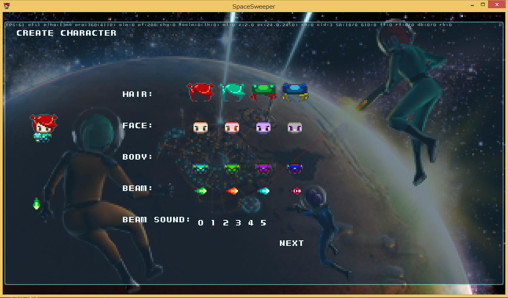

スペース・スウィーパーのセットアップ
====
CCDKには、スペース・スウィーパーのビルドとプレイに必要なすべてが含まれています。
スペース・スウィーパーのソースコード、画像、効果音、BGMのファイルは、
次の位置にあります : 

~~~
CCDK/games/ss
~~~


### セットアップ手順
スペース・スウィーパーでマルチプレイをするには、バックエンドサーバーが必要です。
バックエンドサーバーを構築する方法は、[CCDK セットアップ手順](Setup.ja.md) 
を参照してください。ここではバックエンドサーバーのセットアップ手順の説明は省略します。

スペース・スウィーパーは、MacOS Xと Windowsで動作します。

ビルドには大きく3つのステップがあります。

1. 外部モジュールをgitで取得する
2. 外部モジュール(moyai)をビルドする
3. スペース・スウィーパーをビルドする

以上で、シングルプレイができます。
マルチプレイするためには、さらに次の3つのステップが必要です。

4. Redisサーバーを起動する
5. バックエンドサーバーを起動する
6. スペース・スウィーパーを起動する

スペース・スウィーパーをMCSを用いてストリーミング経由でプレイすることもできます。

7. スペース・スウィーパーをMCSでストリーミングする


### 1. 外部モジュールをgitで取得する
スペース・スウィーパーは、 [moyai]( https://github.com/kengonakajima/moyai ) というゲーム描画用の簡易ライブラリを使って作られています。
スペース・スウィーパーをビルドするにはこれを取得する必要があります。

Github for Windowsの場合は、CCDKレポジトリを取得したときに自動的に取得されているはずです。 
Unix系を含むコマンドライン版gitを使う場合は、CCDKを取得した後に、
CCDKディレクトリで、次のコマンドを入力すると、moyaiの必要なバージョンを取得できます。

~~~
git submodule update --init --recursive
~~~

以上によってmoyaiは、

~~~
CCDK/externals/moyai
~~~

に配置されます。

### 2. 外部モジュール(moyai)をビルドする
[moyaiのREADMEファイル](https://github.com/kengonakajima/moyai)　にも書かれています(英語)が、Windowsでの手順は以下です。
Visual Studio 2012または2013が必要です。

1. moyai/demowin/demowin.sln を開く
2. "demowin"プロジェクトをビルドする
3. demowinプロジェクトを実行する

Windows版のmoyaiには、DebugD3D, DebugOGL, ReleaseD3D, ReleaseOGL
の4つのビルドターゲットがあります。
DirectXを用いるものがD3D, OpenGLを用いるものがOGLです。
CCDKではDebugD3DかReleaseD3Dを使ってください。


MacOS X での手順は、以下の通りです。

~~~
$ cd externals/moyai
$ make
$ ./demo2d
$ ./demo3d
~~~
MacOSではOpenGLのみが利用可能です。デフォルトの状態でデバッグ情報が有効になっています。

以上によって、moyaiレポジトリのgithubページにあるような画面が表示されたら成功です。

### 3. スペース・スウィーパーをビルドする

Windowsでは以下の手順です。

1. ```CCDK/games/ss/sswin/sswin.sln``` を開く
2. sswinプロジェクトをビルドします。
3. sswinプロジェクトを実行します。(F5を押すだけ)

デフォルトの状態では、スペース・スウィーパーは、
localhostにおいてバックエンドサーバーが実行されていることを前提として起動します。
バックエンドサーバーがない状態で起動すると、 
"FATAL ERROR"というメッセージを画面に表示します。
その後の動作は不定です。(クラッシュする可能性もあります)

sswinのデバッグ実行時の引数に、```--offline```を追加することで、
バックエンドサーバー無しでのローカルテストプレイをすることが可能です。
FATAL ERRORが表示されたらビルド成功です。

MacOS Xでは以下の手順です。

~~~
$ cd CCDK/games/ss
$ make depend
$ make
$ ./ss
~~~~

末尾の ```./ss``` でスペース・スウィーパーのゲームを実行しています。
ここでも、 ``` ./ss --offline``` とすることでオフラインプレイができます。


### 4. Redisサーバーを起動する

スペース・スウィーパーのマルチプレイをする際には、バックエンドサーバーが必要です。
バックエンドサーバーは、さらにその裏側でRedisサーバーを使って情報を保存します。
Redisサーバーのビルドと起動方法については、 [CCDK セットアップ手順](Setup.ja.md) を参照してください。

### 5. バックエンドサーバーを起動する
バックエンドサーバーの起動方法は、 [CCDK セットアップ手順](Setup.ja.md) 
で説明した通りですが、スペース・スウィーパーでは、データベース機能も必要になります。
そのため、 CCDK/CCDK.sln において backend プロジェクトを実行するときには、
```database``` オプションを追加してください。

以下はバックエンドサーバーの起動オプションの例です。

~~~
realtime database --maxcon=10
~~~

バックエンドサーバーは、
```localhost``` において Redisサーバーが起動していることが必要です。


### 6. スペース・スウィーパーを起動する

Redisサーバーとバックエンドサーバーを同じマシンで起動できたら、
次にスペース・スウィーパーを起動します。
起動時のオプションは次のようです。

~~~
--dbhost=localhost --rthost=localhost --username=nobita --debug
~~~

バックエンドサーバーのアドレスは、localhostを用いる場合は省略できます。
したがって次のようにしても上記と同じ設定になります。

~~~
--username=nobita --debug
~~~

起動に成功すると、キャラクター作成画面が表示されます。



手順は以上です。


起動オプション一覧
====

- ```--username=STRING ```  ユーザー名を指定します。これはゲームデータを保存する単位で、上位のシステムによって排他制御されている必要があります。
- ```--dbhost=HOSTNAME``` バックエンドサーバーのデータベース機能をもつプロセスのアドレスを指定します。　例 : "localhost", "192.168.11.2"
- ```--rthost=HOSTNAME``` バックエンドサーバーのリアルタイム機能(ゲーム同期パケット)をもつプロセスのアドレスを指定します。
- ```--debug``` アイテムを追加したりワープといったデバッグコマンドを有効にします。
- ```--autoplay``` 自動的にプレイします。負荷テスト用です。
- ```--autocharge``` エネルギー残量が減ってきたら、自動的に充電します。デバッグ用です。
- ```--speedwalk``` 高速に歩きます。デバッグ用
- ```--infitems``` アイテムが無限になります。デバッグ用
- ```--jsdebug``` ジョイスティックの状態を常にログします。
- ```--ncloc``` nearcastを常にログします。
- ```--skip-wm``` 世界地図画面をスキップします。
- ```--offline``` バックエンドサーバー無しでシングルプレイします。
- ```--fps=NUMBER``` フレームレートを設定します。
- ```--long-db-timeout``` データベースのタイムアウトを遅く設定します。これは無線LANなど遅いネットワークでテストプレイするときに必要なことがあります。


### 7.スペース・スウィーパーをMCSでストリーミングする

MCSを用いてスペース・スウィーパーをストリーミングプレイするのは簡単です。
以下の手順でできます : 


1. mcs/ShinraDevelopmentStation.exe を起動する
2. プロジェクトを新規作成する
3. CCDK/games/ss をData packにそのまま追加する
4. Startupを追加する。 Data packは3.で追加したものを指定し、 sswin/ReleaseD3D/sswin.exe をExecutableとして指定
5. 必要な引数を追加する(何もなしでOK)
6. Startup設定からゲームを開始

スペース・スウィーパーをMCSのデフォルト設定のまま起動すると、ストリームの遅延が400ミリ秒以上と、プレイテストができないレベルに遅くなることがあります。
その場合は、Startup設定の Custom Propertiesの項目で、

- ```Local.VideoQuality```の値(1~100)を低い値に、たとえば5とか10にしてみるなど
- ```Local.EncoderThreads```の値(デフォルトが2)を増加、たとえば4にしてみるなど

によって劇的に改善する場合があります。
いろいろな値の組み合わせを試してみてください。


